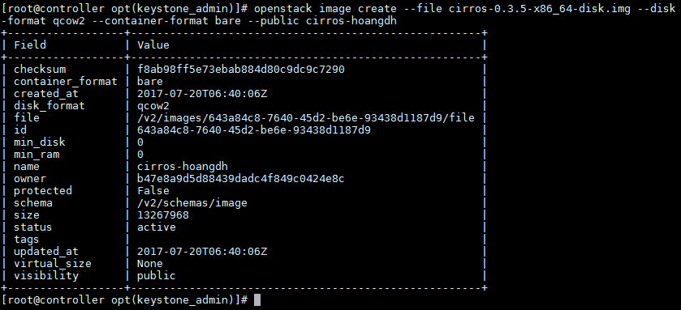
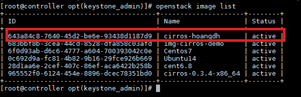
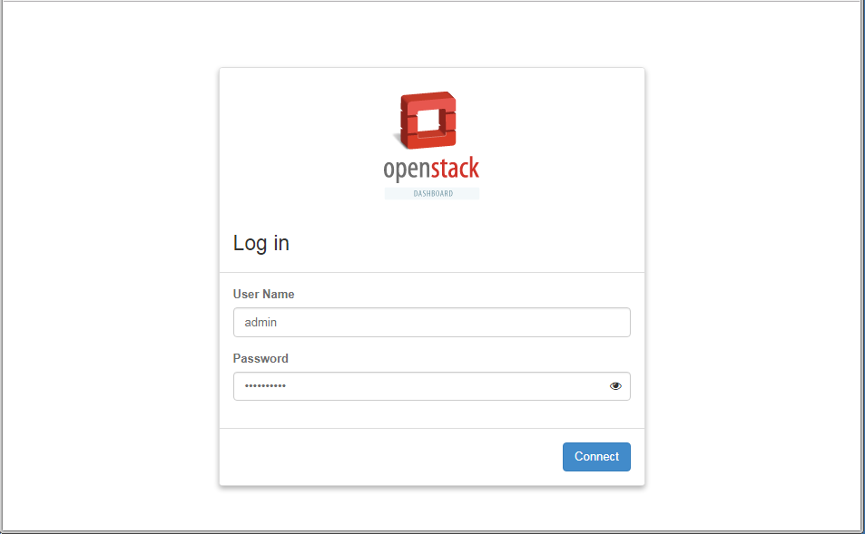
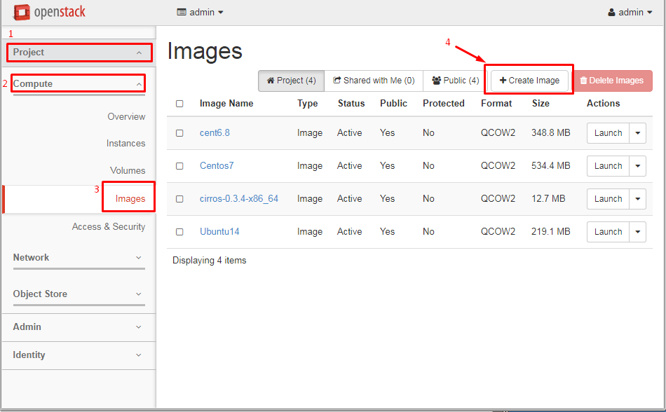
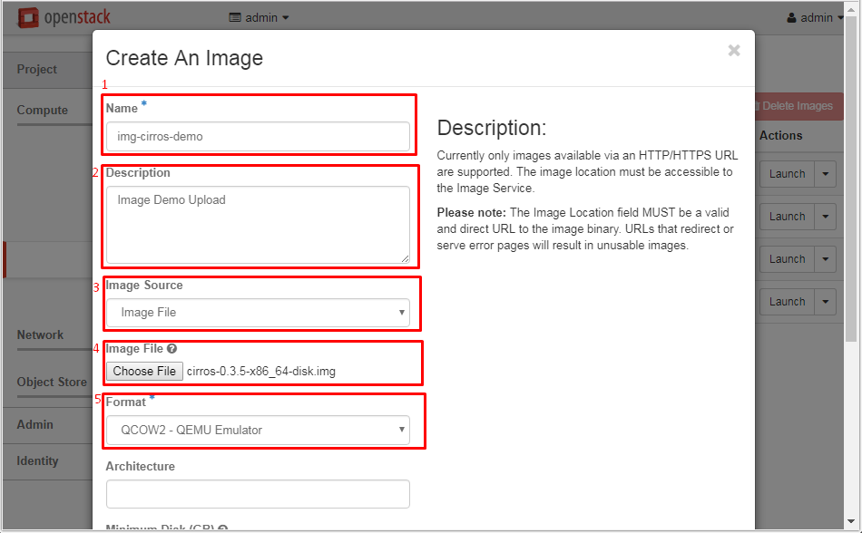
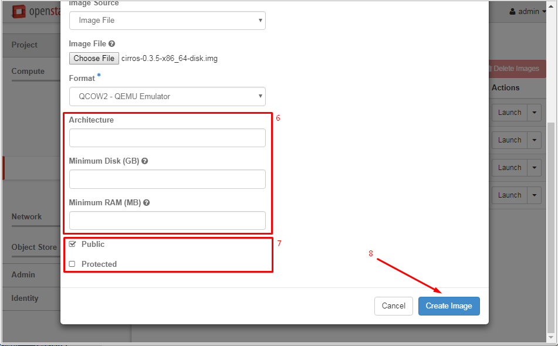
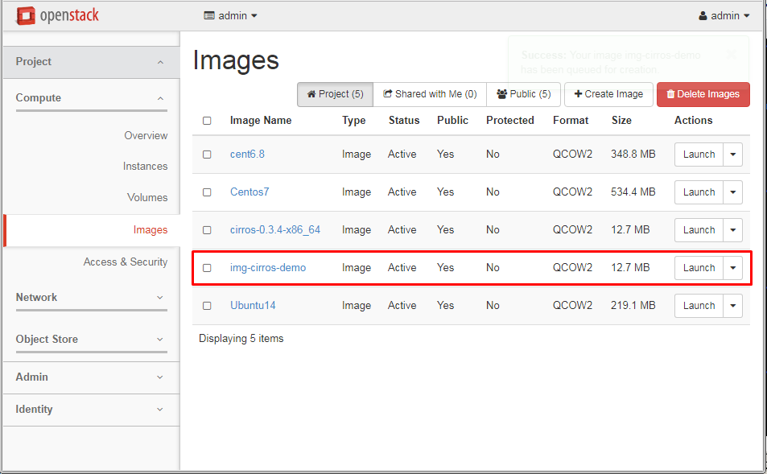

## Hướng dẫn Upload Image lên OpenStack

### Menu

- [1. Tải Images](#1)
	- [1.1 Các trang cung cấp Image](#11)
	- [1.2 Tải trực tiếp từ](#11)
	- [1.2 Từ máy tính](#12)
- [2. Upload images vào OpenStack](#2)
	- [2.1 Bằng câu lệnh](#21)
	- [2.2 Trên Dashboard](#22)
	
<a name="1" />

### 1. Tải Images

<a name="11" />

#### 1.1 Các trang cung cấp Image

Tại trang chủ của [OpenStack](https://docs.openstack.org/image-guide/obtain-images.html) có giới thiệu hàng loạt các trang cung cấp Image cho cloud. Sau đây là những OS được phổ biến hiện nay:

- CentOS
	- [CentOS 6](http://cloud.centos.org/centos/6/images/)
	- [CentOS 7](http://cloud.centos.org/centos/7/images/)

	**Chú ý**:
	
	Trong Image cloud, sử dụng user mặc định là `centos`.

- CirrOS - Image dùng để test

	OS Cloud này dùng để test hệ thống cloud với đặc điểm là nhỏ gọn và dễ dàng sử dụng. Phiên bản mới nhất của CirrOS là [0.3.5](http://download.cirros-cloud.net/0.3.5/cirros-0.3.5-x86_64-disk.img) và [toàn bộ các phiên bản](http://download.cirros-cloud.net/).

	**Chú ý**:
	
	Trong Image cloud, sử dụng user mặc định là `cirros` và password là `cubswin:)`.

- Debian
	- [Trang tải chính thức](http://cdimage.debian.org/cdimage/openstack/)
	
	**Chú ý**:
	
	Trong Image cloud, sử dụng user mặc định là `debian`.

- Fedora
	- [Trang tải chính thức](https://alt.fedoraproject.org/cloud/)
	
	**Chú ý**:
	
	Trong Image cloud, sử dụng user mặc định là `fedora`.

- Microsoft Windows
	- [Trang cung cấp](https://cloudbase.it/windows-cloud-images/)
	
	**Chú ý**:
	
	Với Windows, bạn cần tuân thủ đúng các luật lệ MS đề ra trong khi sử dụng các Image.
	
- Ubuntu
	- [Trang tải chính thức](http://cloud-images.ubuntu.com/)
	- [Phiên bản Ubuntu 16.04 LTS Xenial Xerus (Daily Build)](https://cloud-images.ubuntu.com/xenial/current/)
	- [Phiên bản Ubuntu 16.04 (Link tải nhanh, Khuyên dùng)](http://cloud-images.ubuntu.com/xenial/current/xenial-server-cloudimg-amd64-disk1.img)
	
	**Chú ý**:
	
	Trong Image cloud, sử dụng user mặc định là `ubuntu`.
	
- openSUSE và SUSE Enterprise Server
	- [openSUSE](http://download.opensuse.org/repositories/Cloud:/Images:/)
	- [SUSE Enterprise Server - Dùng thử 60 ngày](https://www.suse.com/products/server/jeos/)
	
- Red Hat Enterprise Linux - RHEL
	- [RHEL 7](https://access.redhat.com/downloads/content/69/ver=/rhel---7/x86_64/product-downloads)
	- [RHEL 6](https://access.redhat.com/downloads/content/69/ver=/rhel---6/x86_64/product-downloads)
	
	**Chú ý**:
	
	Trong Image cloud, sử dụng user mặc định là `cloud-user`.
	
<a name="11" />

#### 1.1 Từ Internet

<a name="12" />

#### 1.2 Từ máy tính

<a name="2" />

### 2. Upload images vào OpenStack

<a name="21" />

#### 2.1 Bằng câu lệnh

Chúng ta chạy lệnh sau để khai báo biến môi trường

```
source /root/keystonerc_admin
```

Sau khi tải IMAGE, chúng ta đưa IMAGE vào máy ảo bằng lệnh:

```
openstack image create --file cirros-0.3.5-x86_64-disk.img --disk-format qcow2 --container-format bare --public cirros-hoangdh
```



Kiểm tra lại thông tin:

```
openstack image list
```


<a name="22" />

#### 2.2 Trên Dashboard

- **Bước 1:** Đăng nhập vào Dashbroad

Chúng ta tìm đến **Project -> Compute -> Images**



- **Bước 2:**  Điền thông tin cho Images





- **Bước 3:** Upload IMAGE



- **Giải thích:**
	- `1` - **Name**: Tên của IMAGE
	- `2` - **Description**: Mô tả IMAGE
	- `3` - **Image Source**: Chọn nguồn lưu trữ file. `Image file`: Chọn từ máy remote
	- `4` - **Image File**: Chọn file tải lên từ máy tính của bạn
	- `5` - **Format**: Định dạng máy ảo. Nên chọn: QCOW2
	- `6`: Cài đặt cấu hình tối thiểu cho IMAGE như `Arch` - CPU (x86_64,...); RAM; DISK
	- `7` Chia sẻ IMAGE với project, domain khác hay không

Sau khi Upload xong, chúng ta nhìn trên Dashboard đã có một IMAGE mới.

